# Ứng dụng Quản lý Trung tâm ngoại ngữ FLCenter v1.0

## Mô tả
   Ứng dụng giúp bạn theo dõi và quản lý trung tâm ngoại ngữ một cách hiệu quả và chặt chẽ.

   Web dự án: https://github.com/vinh0212/FLCenter
### Ưu điểm:
   - Có sự liên kết cơ sở dữ liệu trong phần mềm. Mặc dù còn nhiều khó khăn do sử dụng CSDL file .xml, nhóm phát triển đã cố gắng tạo ra các sự liên kết giữa các CSDL với nhau, tạo nên sự đồng bộ cao giữa các chức năng của phần mềm.
   - Có hỗ trợ Tìm kiếm theo nhiều tiêu chí giúp dễ dàng tìm kiếm với nhiều thuộc tính khác nhau.
   - Phần đăng nhập có hỗ trợ Lưu mật khẩu để dễ dàng bỏ qua bước nhập mật khẩu khi đăng nhập.
### Nhược điểm
   - Do không sử dụng hệ CSDL như MySQL nên phần mềm chưa cho phép tạo/thay đổi tài khoản đăng nhập hệ thống cũng như phân quyền truy cập.
   - Do chưa có điều kiện tiếp xúc trực tiếp với thực tế công việc ở các trung tâm ngoại ngữ nên các chức năng vẫn mang tính demo là chính.

## Tải xuống bản đóng gói mới nhất
   - Tìm phần Releases, sau đó chọn phiên bản mới nhất và tải xuống (Hiện tại là v1.o-BETA)

## Hướng dẫn sử dụng

### Đăng nhập

  - Nhập đầy đủ thông tin đăng nhập từ nhà phát triển cung cấp
  - Sign in để đăng nhập 

### Chức năng của admin

#### Quản lý học viên
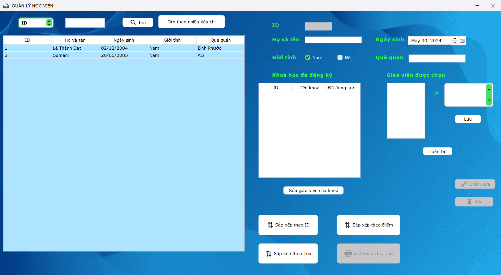
  - Quản lý thông tin của toàn bộ học viên các lớp ( bao gồm việc sắp xếp, xóa, chỉnh sửa, tìm kiếm thông tin học viên)
  - In thông tin của một học viên bất kì (PDF)
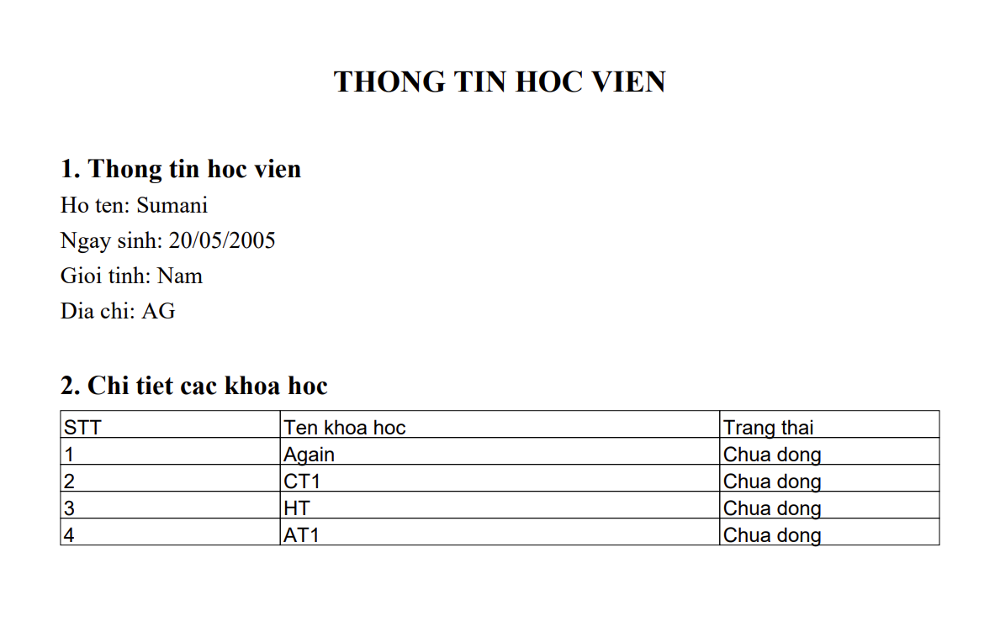

#### Quản lý môn học

  - Quản lý thông tin của các môn học ( bao gồm việc sắp xếp, thêm, xóa, chỉnh sửa, tìm kiếm thông tin môn học)

#### Quản lý kỳ thi

  - Quản lý thông tin của các kỳ thi ( bao gồm việc sắp xếp , thêm , xóa, chỉnh sửa, tìm kiếm thông tin các kỳ thi)

#### Quản lý khóa học

##### Danh sách khóa học
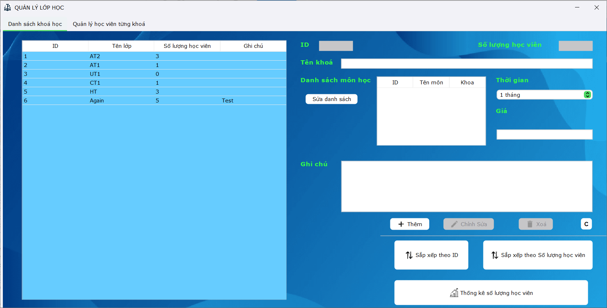
  - Quản lý số lượng của các lớp học  ( bao gồm việc sắp xếp, thêm, xóa, chỉnh sửa số lượng học viên) và quản lý tất cả các lớp của trung tâm
  - Thống kê số lượng học viên theo khóa

##### Quản lý học viên từng khóa
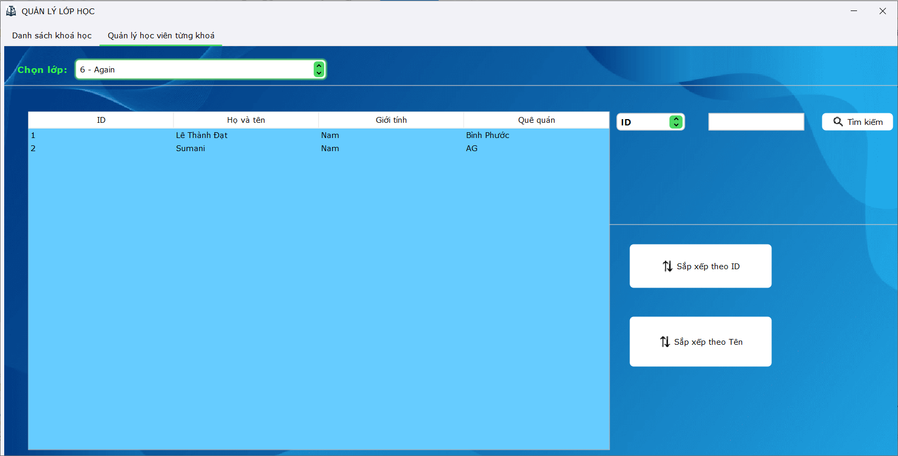
  - Quản lý thông tin của các học viên theo từng lớp ( bao gồm việc sắp xếp, thêm, xóa, chỉnh sửa, nhập điểm, tìm kiếm thông tin học viên)

### Quản lý tài liệu
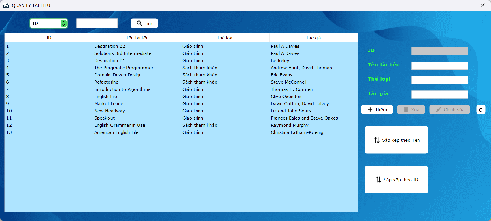
  - Quản lý thông tin của các tài liệu ( bao gồm việc sắp xếp, thêm, xóa, chỉnh sửa, tìm kiếm thông tin tài liệu)

### Quản lý cán bộ

  - Quản lý thông tin của toàn bộ cán bộ ( lãnh đạo và giảng viên ) của trung tâm ( bao gồm việc sắp xếp, thêm, xóa, chỉnh sửa, tìm kiếm thông tin cán bộ)

#### Đăng xuất
  - Trả về màn hình đăng nhập

#### About 
  - Thông tin về tác giả và các mã nguồn

### Chức năng của staff
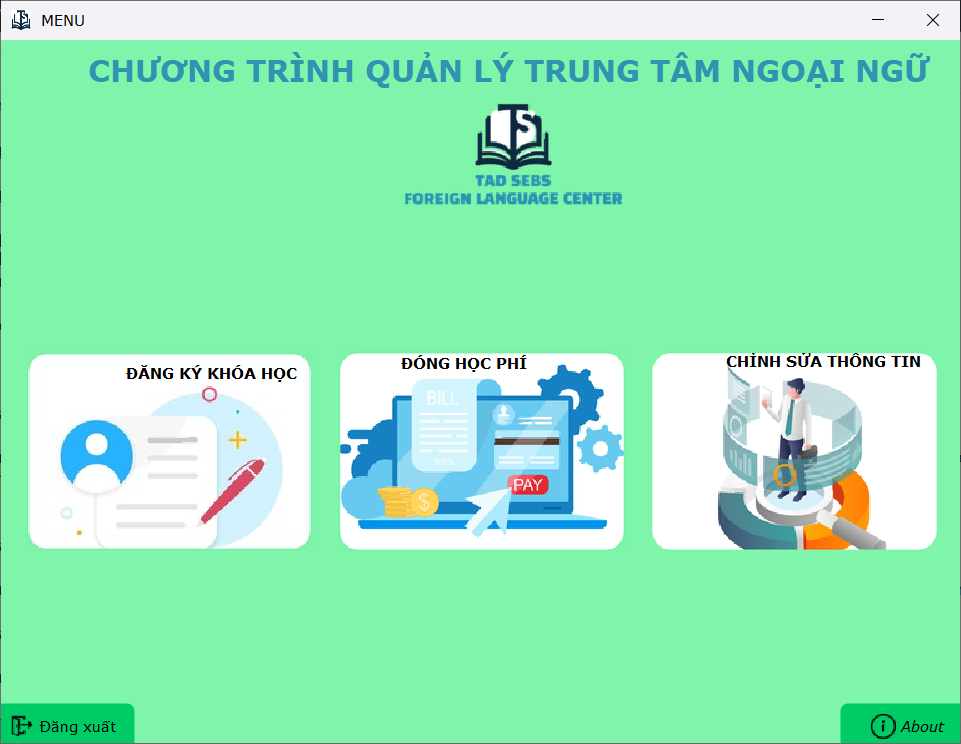

#### Đăng ký khóa học
- Với 4 bước đăng ký cực đơn giản
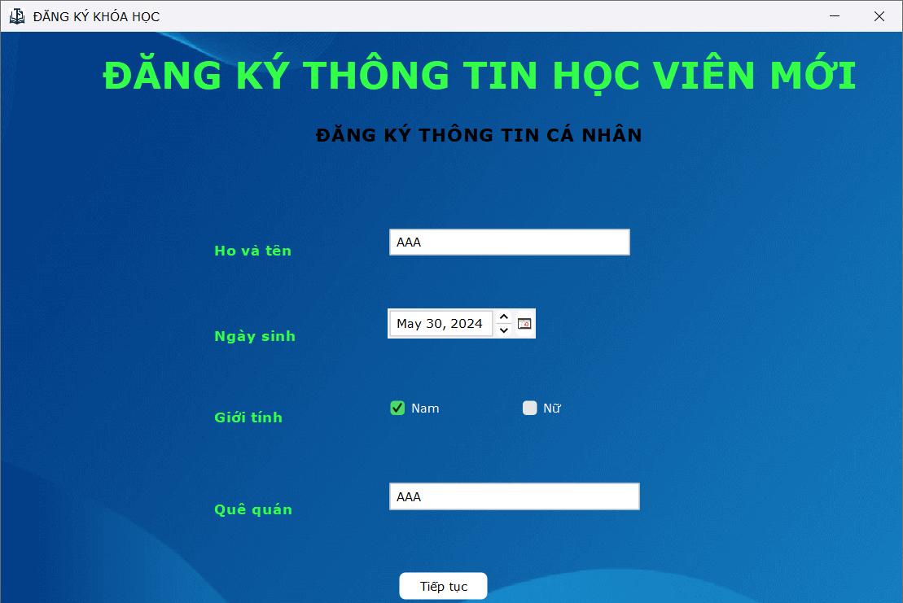
  - Đăng ký thông tin cá nhân

  - Đăng ký khóa học
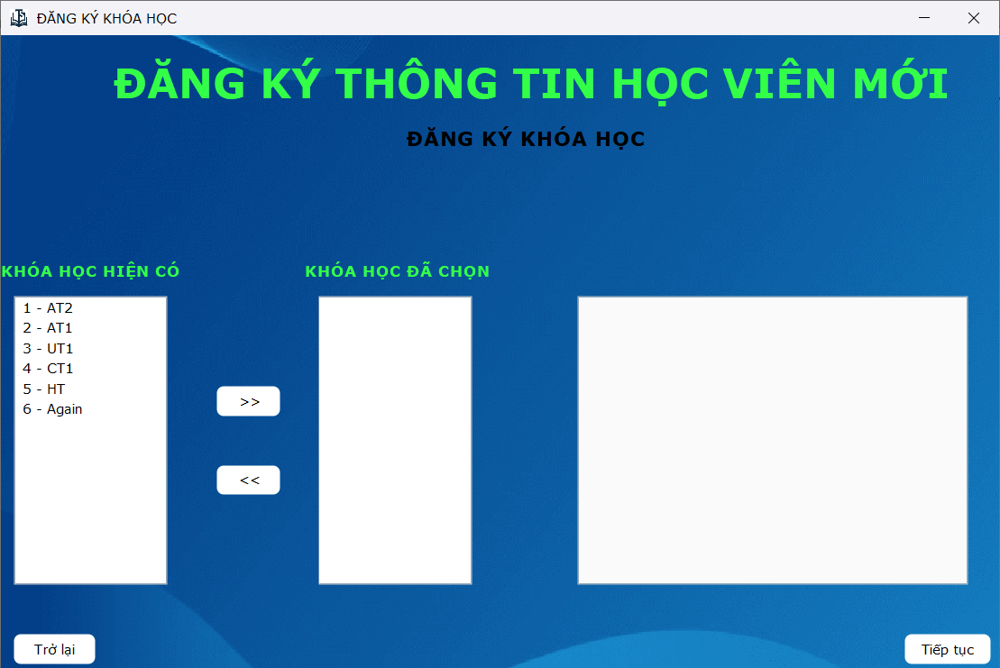
  - Lựa chọn giáo viên	
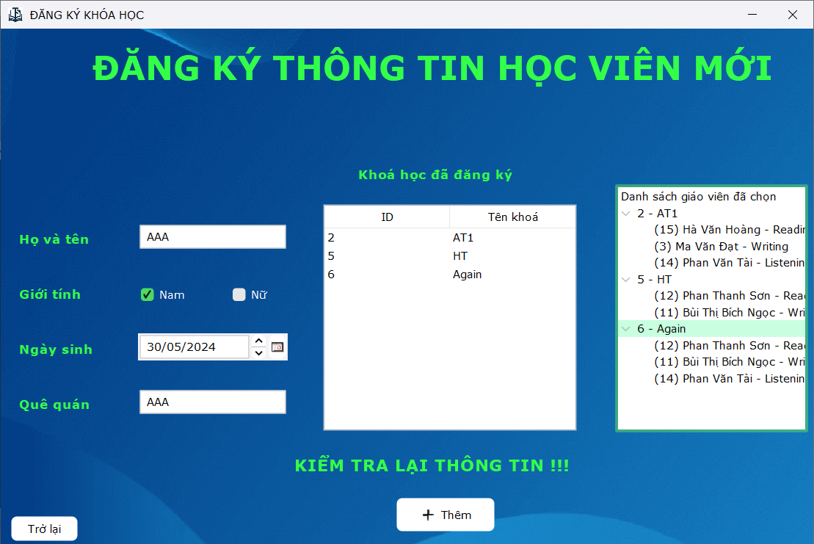
  - Kiểm tra lại toàn bộ thông tin và hoàn tất đăng ký

#### Đóng học phí
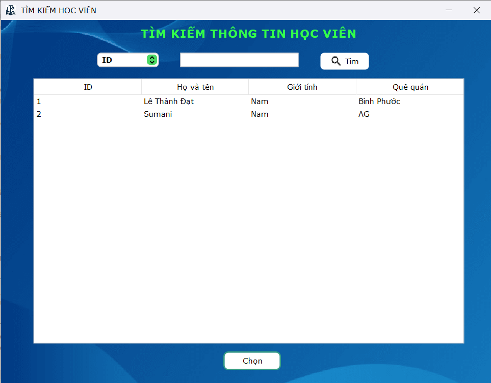
  - Tìm kiếm và lựa chọn học viên cần đăng ký 
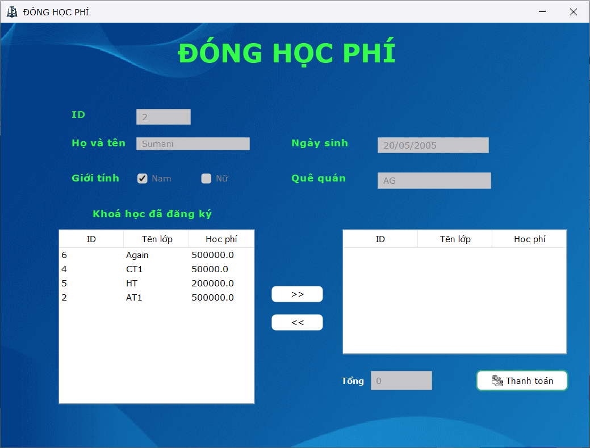
  - Lựa chọn các gói muốn đóng và nháy nút thanh toán

#### Chỉnh sửa  thông tin học viên

  - Tìm kiếm và lựa chọn học viên cần chỉnh sửa
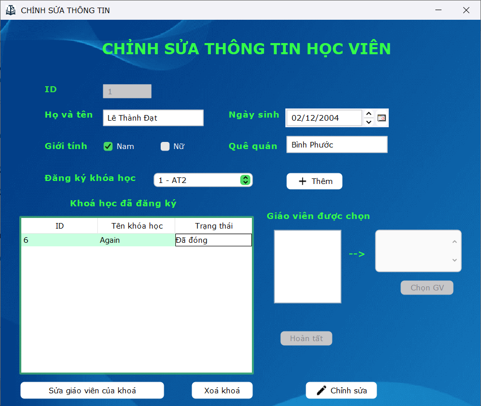
  - Chỉnh sửa thông tin học viên

## Cấu trúc Thư mục
- `java/`: Chứa mã nguồn của ứng dụng.
- `resources/`: Chứa các tài nguyên tĩnh như HTML, CSS và hình ảnh.

## Cấu trúc file đóng gói
- File đóng gọi dạng file zip, có thể tìm tháy ở phần Releases
- File đóng gói bao gồm 1 file chương trình .jar, 1 folder `conf/` chứa các file tĩnh, các file data .xml
- Lưu ý: Giải nén file đóng gói trước khi sử dụng. Sau khi giải nén, nhấn chọn file `flcenter-1.0.jar` để khởi động chương trình.

## Yêu cầu Hệ thống
- JDK 21 hoặc hơn.

## Tác giả và Giấy Phép
- Tác giả: Lê Thành Đạt - Đặng Quang Vinh
- Email: ltdatdz@gmail.com  - dqv.0212@gmail.com

## Trạng Thái Dự Án
- Dự án hiện đang được phát triển và không phải là phiên bản ổn định.
